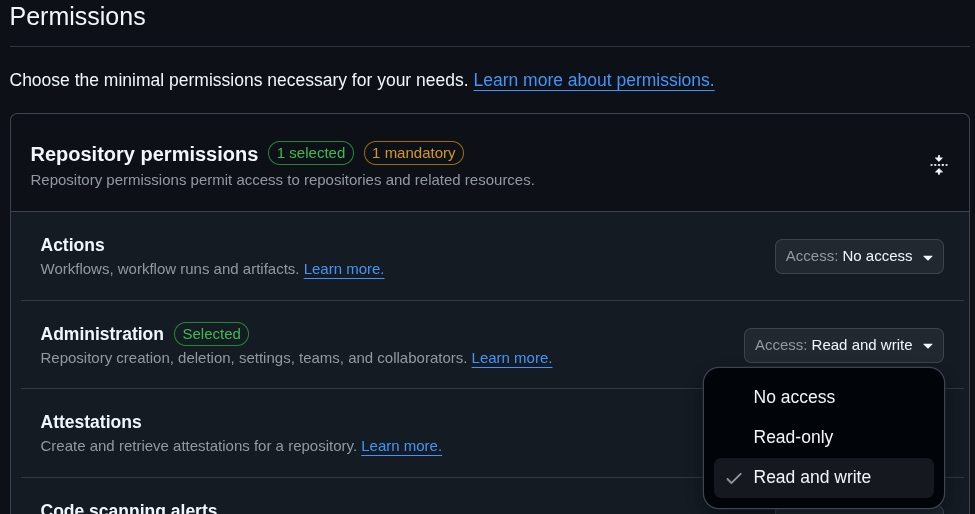
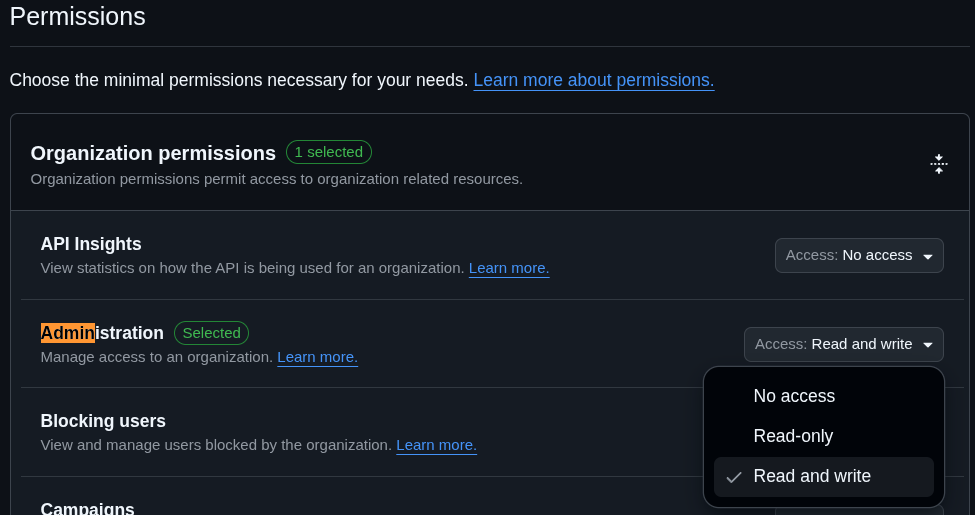
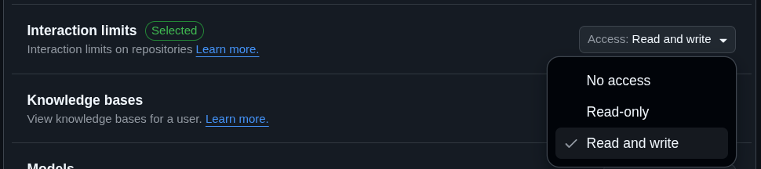

# GitHub Action - Permanent Interaction Limits

This GitHub Action cyclically re-enables temporary interaction limits to make them effectively permanent

You can apply these limits to a repository, an organization, or a user account

## Pre-requisites

### Personal Access Token

To consume this Action you will need a GitHub Fine-Grained Personal Access Token (PAT) with the right permission

1. If you use an `"organization"` scope, first you want to disable the expiry of your organization's Personal Access Tokens
   1. Navigate to [your organization's settings](https://github.com/organizations/<ORGANIZATION_NAME>/settings) → [Personal Access Tokens Settings](https://github.com/organizations/<ORGANIZATION_NAME>/settings/personal-access-tokens) → Fine-grained tokens → Set maximum lifetimes for personal access tokens
   2. Disable "Fine-grained personal access tokens must expire"
2. Navigate to [your Fine-Grained Personal Access Tokens](https://github.com/settings/personal-access-tokens) → [Generate new token](https://github.com/settings/personal-access-tokens/new)
3. Fill "name". _**Suggestion**: `GitHub-Action_Permanent-Interaction-Limits`_
4. _**Optional**: You can fill "description" with: `https://github.com/marketplace/actions/permanent-interaction-limits#pre-requisites` for reference_
5. Select the proper "Resource Owner"
6. Set the expiration to : "No expiration"
7. Select the proper "Repository Access" (select at least the repositories in which you use this action))
8. About "Permissions", if your `scope` will be :
   - **`"repository"`** : 
   - **`"organization"`** : 
   - **`"user"`** : 
9. Copy the generated token and add it as a secret in your repo/org (e.g. `PERMA_LIMIT_PAT`).

## Usage

<!-- REUSABLE WORKFLOWS EXAMPLES -->

### Repository

### Organization

### User

## Inputs

| Input    | required | type                                                              | default                                 | description                                                                                                                                         |
| -------- | -------- | ----------------------------------------------------------------- | --------------------------------------- | --------------------------------------------------------------------------------------------------------------------------------------------------- |
| `token`  | `true`   | `string`                                                          |                                         | A GitHub Personal Access Token (PAT) with the required permissions: “Administration” (read+write) for repos/orgs or “Interaction limits” for users. |
| `scope`  | `false`  | `"existing_users" \| "contributors_only" \| "collaborators_only"` | Uses current interaction limits setting | The scope to apply for the interaction limits.                                                                                                      |
| `target` | `false`  | `"repository" \| "organization" \| "user"`                        | `"repository"`                          | The target entity for applying the interaction limits.                                                                                              |
